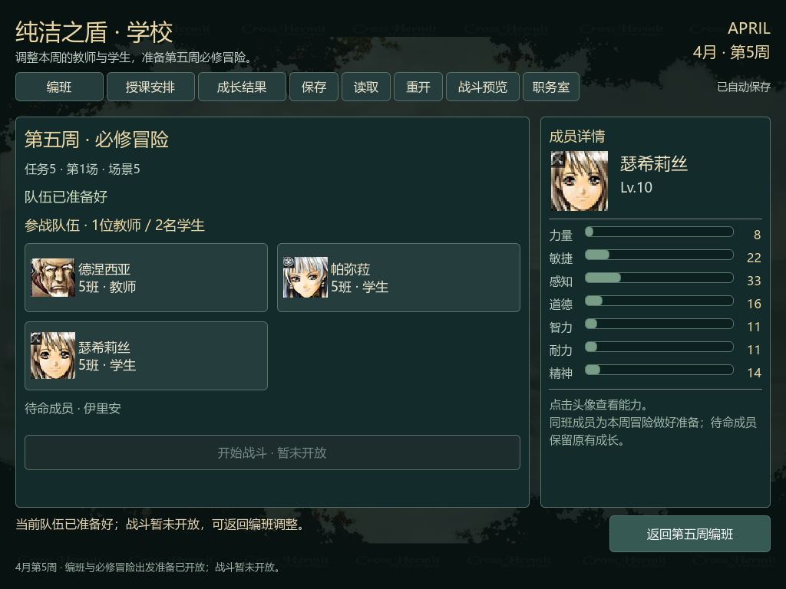
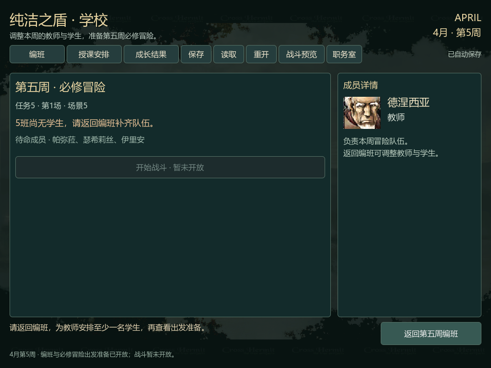

# 第五周必修冒险出发准备验收

2026-10-08，Godot4.7.2，Windows/OpenGL，RTX3060Ti。用户的继续指令承接原版必修冒险路线建议：直接选课改为课程查看/锁定，既有职务室与第五周编班四阶段按修正范围完成，再增加原版出发核对、当前队伍投影、图形准备页与综合验收。本变更八项完成；实际冒险战斗仍是后续工作。

## 当前可操作行为

第五周编班/课程页点击「必修冒险 · 出发准备」，显示任务5、场景5、当前教师/学生头像和班号、待命成员与是否就绪。名单来自实际当前学校；移到第五班或让学生待命后立即重新计算。教师孤班和全部待命会提示原因。点击成员查看实际成长后的能力，返回编班可继续调整。

查看不新增保存命令、不递增revision、不改变角色/日期/MVP/gate。保存沿用version4和原有十项指纹；重启恢复编班后重新打开准备得到相同名单。存读档失败、重开取消、第四周回顾、职务室往返和课程查看保留计划。实际「开始战斗」禁用；顶部战斗预览仍是独立演示，尚未消费本周名单。

## 验证与证据

| 检查 | 结果 | 日志 |
|---|---|---|
| 同CPU原版出发准备 | 原班/学生待命/第五班就绪，教师孤班/全部待命不就绪；准备前后学校/角色/计数相同 | [native-final](../school-adventure-preparation-native-final-20261008.log)、[来源报告](../school-adventure-preparation-v1-20261008.json) |
| Python来源与素材 | 12项，0失败（新增准备5、既有第五周来源4、职务室素材3） | [python-final](../school-adventure-preparation-python-final-20261008.log) |
| 全量模型 | 60套件397项，0失败且无SCRIPT ERROR | [model-final](../school-adventure-preparation-model-final-20261008.log) |
| 新窗口离屏输入 | 131检查，0失败 | [window-headless](../school-adventure-preparation-window-headless-20261008.log) |
| 新窗口实际渲染 | 140检查，0失败；9张最终截图 | [window-final](../school-adventure-preparation-window-final-20261008.log)、[verification](verification.json) |
| 旧编班/结果/导航/第四周剧情/周到达/第五周剧情/会话导航/职务室编班 | 80/72/26/76/51/157/22/163检查，均0失败 | acceptance.json列出八份正式日志与SHA |
| OpenSpec严格 | 30项通过，0失败 | [specs](../school-adventure-preparation-specs-20261008.log) |

来源4A7D30与4A6A10延续上轮实际4/4授课→剧情/周推进→4/5 Chapter018→职务室/CH002/Chapter205→学校初始化的同一CPU。成员移动调用原版4A4680、4A5F40和4A95F0，鼠标/释放为明确输入边界。只导出已定义评级和场次字段，不把未初始化栈字/缓冲区尾部当作语义输出。运行规则单独由任务5原始表字节导出；fixture仅用于测试。

学校提交4A1920、后继状态10、场景事件/战斗、完成奖励与后续授课解锁尚未执行。学校完整菜单时间线、live_witness与原版持久写入授权仍未完成/为false。所有窗口测试只操作自有命名测试存档，未修改实际试玩存档、原版SAV或原版程序。

## 视觉核对

本目录9张1024×768截图均逐张检查：初始队伍、成长详情、学生待命、教师孤班、第五班、保存、重启恢复、保存失败、全部待命。人物卡、说明、按钮与页脚无溢出；教师说明明确返回编班调整。verification记录截图SHA，acceptance重新核对实际字节。





## 复验

```bash
PYTHONIOENCODING=utf-8 .venv-audit/Scripts/python.exe -m unittest tools.tests.test_school_adventure_preparation_emulation tools.tests.test_school_fifth_planning_emulation tools.tests.test_school_workroom_export
~/bin/godot --headless --path prototype -s res://sim/tests/test_runner.gd
~/bin/godot --headless --path prototype -s res://ui/tests/test_school_adventure_preparation_window.gd
~/bin/godot --path prototype -s res://ui/tests/test_school_adventure_preparation_window.gd -- --capture-dir=/absolute/new-directory
openspec validate --all --strict
```

新渲染必须使用空的新目录，不覆盖历史verification或截图。正式报告、规则、fixture与截图清单采用LF；十项保存指纹与上轮验收及Git字节相同。精确SHA见[acceptance.json](acceptance.json)。

首次native日志记录移动被授课结果祖先的按钮边界接管，修正为movement阶段使用既有移动hook；首次模型日志记录测试误用不存在的字段，已用member_profiles并重跑全量。初版9张渲染截图保留，最终v2修正教师操作说明。兼容school_fifth_planning_window的一份日志在进程仍写入时被换行整理产生两个NUL，原字节保留为诊断，正式证据使用final-school_fifth_planning_window重新跑出的无NUL日志。上述诊断不作为通过证据。

范围、来源、模型、UI分别本地提交246ee11、6fc3c51、fc837a9、f4e0d87；本验收与当前文档单独提交。未push，预先存在的六个未跟踪skill目录保持原样。[上轮历史子集验收](../school-fifth-planning-final-v2-20261008/README.md)保留当时范围待确认字段，当前范围已由继续指令解决。

下一段接学校提交/状态10与场景5的实际任务准备，让这里的当前队伍真正进入可操作战斗，再核对完成与返回学校，最后处理必修限制解除。
