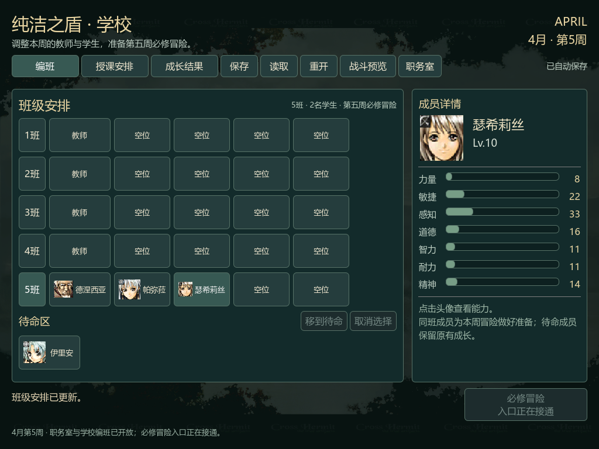
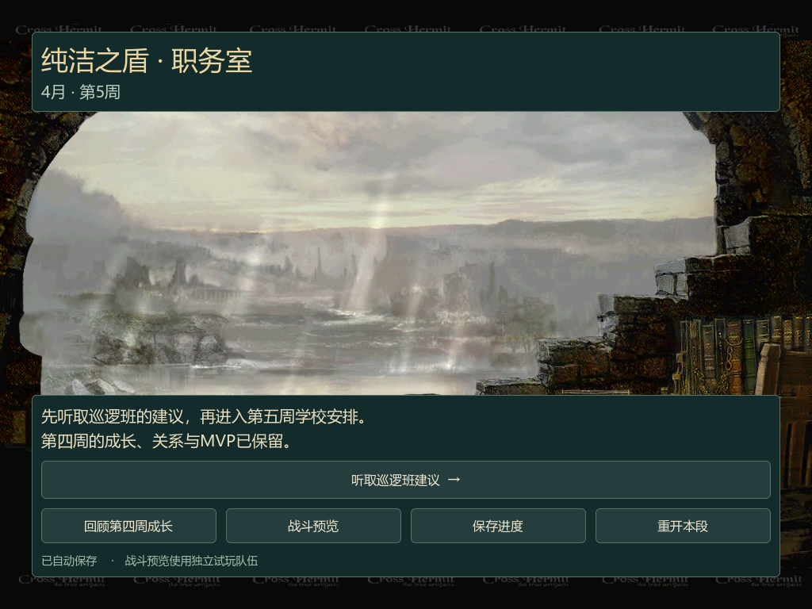

# 第五周职务室与编班：已验证子集

2026-10-08，Godot 4.7.2，Windows/OpenGL，RTX 3060 Ti。当前可操作链为第四周授课/MVP → Chapter016/017 → 4/5 Chapter018 → 职务室 → Chapter205巡逻班对白 → 第五周编班。新增原版BG002_B、SC101/117与32页62条原文，累计267页386条剧情原文。

原版同CPU执行确认第五周有必修冒险，学校初始化设置adventure_gate=1；模式操作强制冒险模式。当前可调动教师/学生、查看课程、回顾第四周成长、保存/读取和往返独立战斗预览，不能直接授课。必修冒险入口、与学校阵容共享的战斗、完成后授课解锁和第二次成长均未接通。原版交互菜单正文未执行，学校数据前缀完成不等于原版现场已走通。

原定直接选课与来源规则冲突，已请求用户选择按原版顺序接通必修冒险，或另建独立授课样例。确认前不改写范围、不标记变更全部完成；tasks目前为1/4，模型与界面的已验证子集分别提交。此处“通过”只覆盖下面列出的实际能力。

## 验证

| 验证 | 结果 | 日志 |
|---|---|---|
| 完整模型 | 59套件391项，0失败 | [model-final](../school-fifth-planning-model-final-20261008.log) |
| 新模型子集 | 7项，0失败 | [model-focused](../school-fifth-planning-model-focused-20261008.log) |
| 来源/素材Python | 23项，0失败 | [python-final](../school-fifth-planning-python-final-20261008.log) |
| 旧来源Python兼容 | 28项，0失败，含与上行重叠的4项 | [legacy-python](../school-fifth-planning-legacy-python-20261008.log) |
| 原版正常/继续等待/对白按键等待 | 正常初始化，等待不初始化 | [native-v2](../school-fifth-planning-native-v2-20261008.log) |
| 旧学校原版前缀 | helper提取后仍通过 | [legacy-native](../school-fifth-planning-legacy-native-20261008.log) |
| 新窗口离屏输入 | 163检查，0失败 | [window-headless](../school-fifth-planning-window-headless-20261008.log) |
| 新窗口实际渲染 | 177检查，0失败；14张截图 | [window-final](../school-fifth-planning-window-final-20261008.log)、[verification](verification.json) |
| 旧编班/结果/导航/第四周剧情/周到达/第五周剧情/会话导航 | 80/72/26/76/51/157/22检查，均0失败 | acceptance.json列出七份日志与SHA |
| OpenSpec严格校验 | 30项通过，0失败；不是完成状态证明 | [specs](../school-fifth-planning-specs-20261008.log) |

Python两组的去重合计为47项。新窗口覆盖原版v3出口迁移、职务室保存/恢复、全部32页、前后页/Esc/确认跳过、教师/学生调动与非法放置、授课锁定、第四周回顾、第五周保存/恢复、职务室往返、重开取消、战斗暂停/返回与保存失败留在当前页面。version4兼容v1/v2/v3，旧版本新命令、篡改指纹/状态/规则/素材均原子拒绝。所有测试仅操作自有命名测试存档，未修改实际试玩存档、原版SAV或原版程序。

## 截图检查

本目录14张1024×768截图均已逐张查看：职务室/恢复、巡逻班开场/双立绘/恢复/跳过确认、第五周初始/调动后编班、课程锁定、第四周回顾、读档、战斗预览/返回、确认跳过后编班。立绘与对白无溢出，学校标题与详情说明使用第五周冒险准备文案。截图SHA由verification.json生成，acceptance.json重新核对。





## 复验与保留的诊断

```bash
~/bin/godot --headless --path prototype -s res://sim/tests/test_runner.gd
~/bin/godot --headless --path prototype -s res://ui/tests/test_school_fifth_planning_window.gd
~/bin/godot --path prototype -s res://ui/tests/test_school_fifth_planning_window.gd -- --capture-dir=/absolute/new-directory
openspec validate --all --strict
```

渲染复验必须使用新目录，不能覆盖现有verification.json或截图。源规则/目录十项SHA与Git提交字节一致，来源文件固定LF换行；详情见acceptance.json。

历史诊断均保留，不作为本次通过证据：v1报告fade=false仍能初始化学校，正式v2改用实际按键等待；model-initial日志为旧版本断言尚未更新，model-stage2为assert_ne不存在的解析错误，window-first为SC槽10越界，均已修复并由最终测试覆盖。compat-playground_navigation_window是错误脚本名调用；window-rendered初次传错capture参数没有截图。final-20261008目录及window-captures日志是更新第五周标题文案前的一次通过记录，正式验收使用本final-v2目录与window-final日志。

本轮来源/素材/模型/界面提交依次为95be8fa、77c6231、d380278、195b7c2；文档与验收随后单独提交。全部为本地提交，未push。
