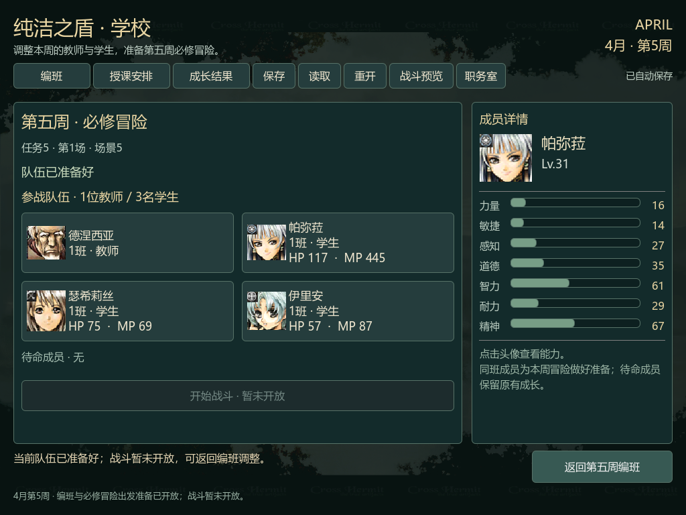

# 战术启动边界与当前HP/MP验收（2026-10-09）

本轮完成实际学校CPU的pending16消费、原版外层战术任务构造、脚本工作区初始化和学生启动规范化。自然启动停在common.bin资源入口；TactStart05.bin是独立标注的同场景选择探针结果。图形/UnitCtrl子构造、实际资源装载、地图、敌人和事件世界仍未执行，不能开始本周实际战斗。

- 原版5个班级分支：3个就绪状态创建任务、2个拒绝状态零分配/资源请求。日历、角色、MVP和必修gate保持。
- Godot62套件409项、来源/导出27项、出发准备155项离屏/165项实渲染、第五周学校163项、导航22项、严格规格30项，全部通过。
- 新界面显示当前学生HP/MP；改班、待命、保存重开、异常装备声明注入与恢复均检查。10张Windows OpenGL截图逐一查看，无卡片文字、头像、详情或页脚越界。
- v4的10项存档规则与b7391cc字节一致；前轮原版报告及导出数据保留原字节。
- 17/17任务完成，规划、原版来源、图形界面和验收分阶段本地提交，未push。

[来源与执行边界](../../docs/school_tactical_startup.md) · [检查摘要](acceptance.json) · [文件SHA](verification.json) · [全部截图及原始校验](../school-tactical-startup-ui-v1-20261009/verification.json)。隔离构造/零学生排错诊断和早期错误日志保留，实际CPU成功基线是native-v6；独立诊断不替代连续学校证据。

下一步执行UnitCtrl子构造和common.bin真实装载/解析，建立场景5双方出场、敌人及事件初态；然后接重制完整地图/单位与当前队伍的图形战斗。战后奖励、gate清除和下一轮授课尚待后续阶段。
